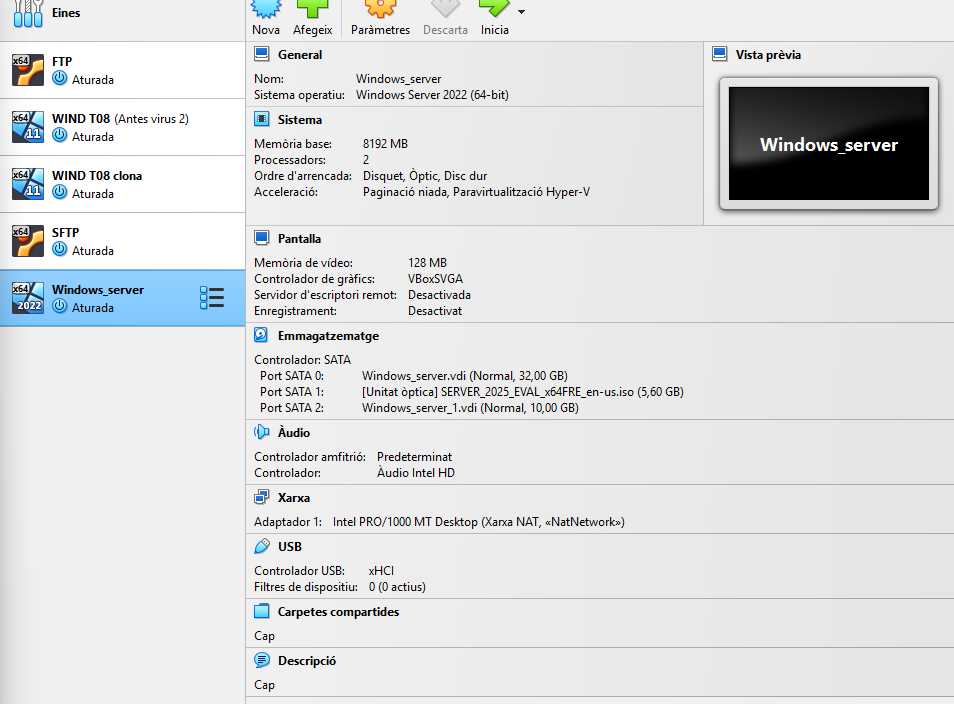
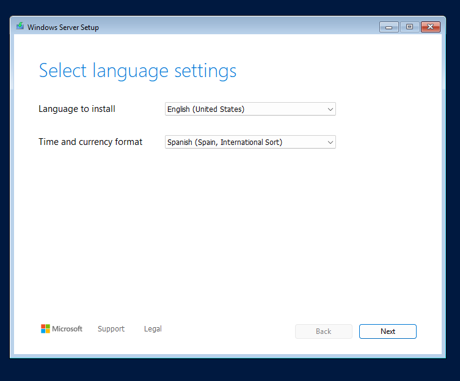
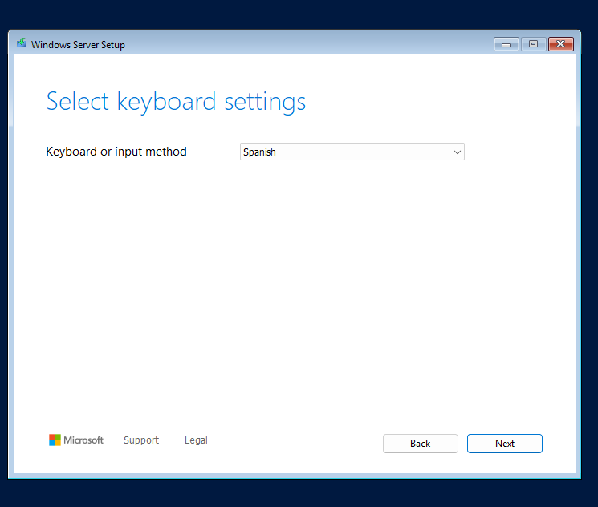
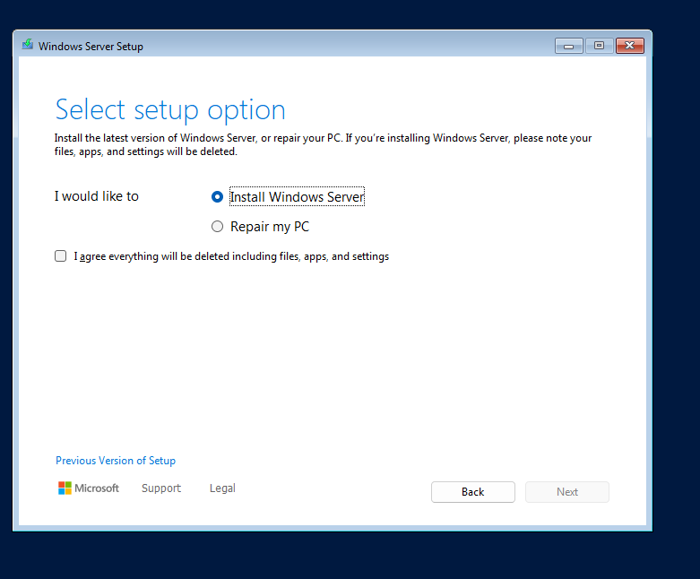
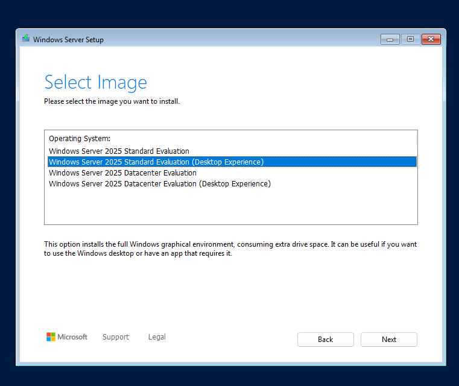
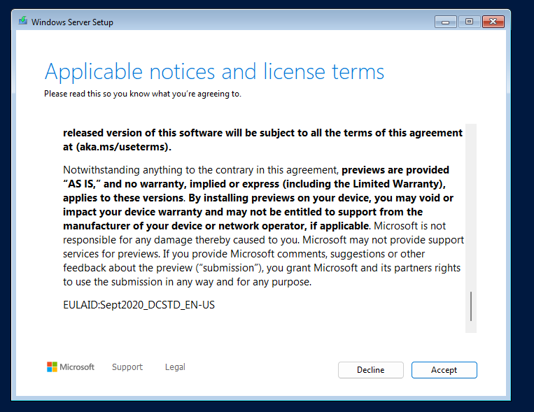
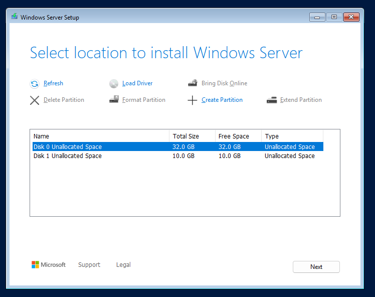
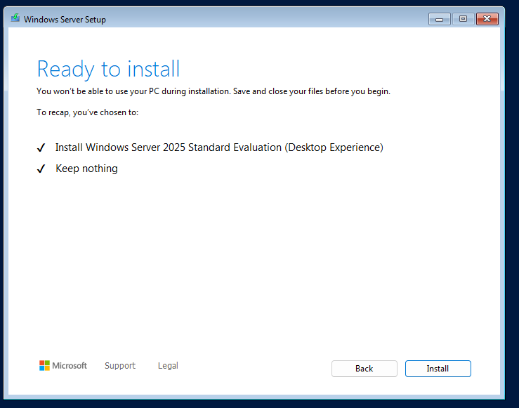
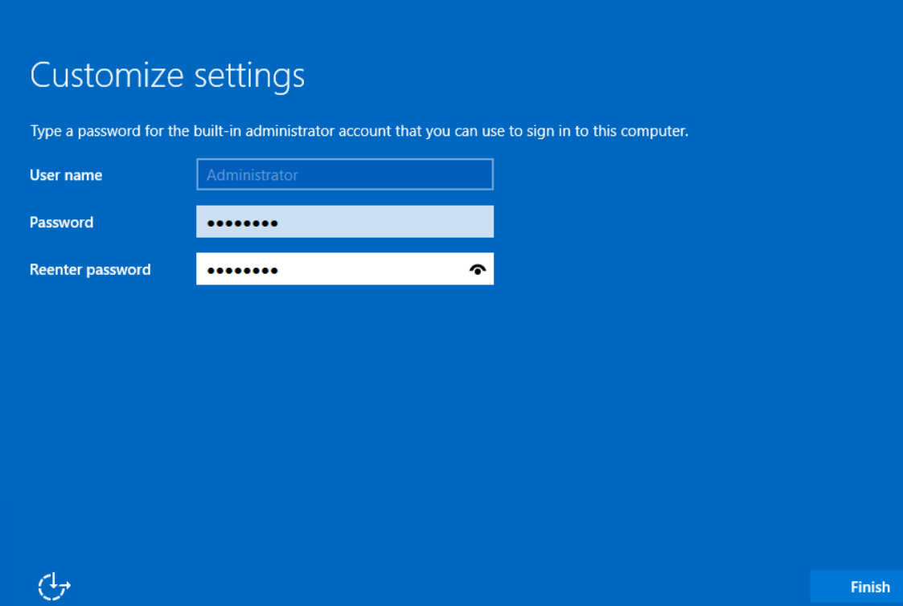

Primer de tot crearem una màquina amb l'ISO de Windows server, amb els següents detalls  8 GB de RAM i dos processadors. La VM disposarà de dos discos, un de 32 GB com a disc principal) i un de secundari de 10 GB. La màquina haurà de tenir dues interfícies de xarxa: una en xarxa NAT (no NAT) i la segona en host-only.

En aquest apartat l’idioma principal l’escollirem com anglès d’USA, i el teclat en espanyol d’Espanya

Aqui tornem a posar spanish,

Li donem a agree

Nosaltres en aquest apartat triarem l'opció d’entorn gràfic,

Aquí només és donar-li a què acceptem els terminis de la llicència

Aquí és on triem en quina unitat volem instal·lar el so en el nostre cas de 32 GB

Aquí només li donem a install,

En aquest apartat ens sortirà que com user name administrador, no l’hem de tocar, només posar com a contrasenya P@ssw0rd

